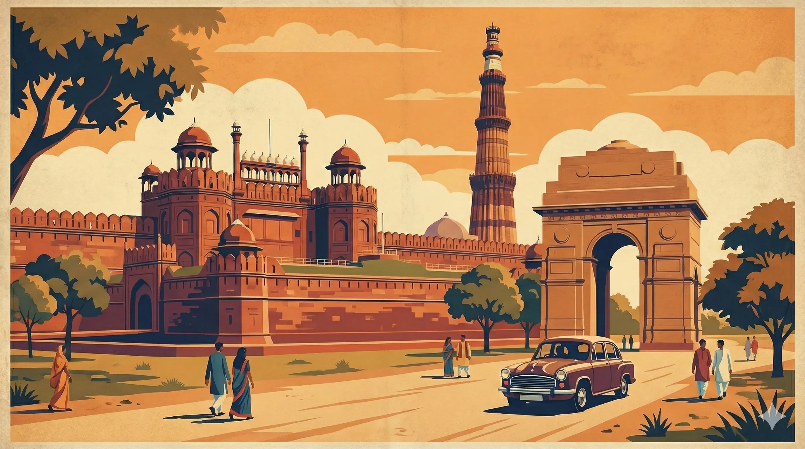

# BharatOne (OneMetro) — India's Integrated Metro Portal

**BharatOne** is a high-performance, aesthetically premium web application designed to be the single source of truth for all metro and rapid transit systems across India. Built with a focus on speed, clarity, and visual excellence, it provides detailed information on lines, stations, and geographic map layouts for cities nationwide.



## 🚀 Key Features

- **Multi-City Support**: Comprehensive data for major hubs including Chennai, Delhi, Mumbai, Bengaluru, Kolkata, Hyderabad, Pune, Nagpur, Ahmedabad, and 6 newly added cities.
- **Dynamic Interaction**: 
  - **Interactive Metro Maps**: Responsive, zooomable, and pan-able SVG maps generated programmatically.
  - **Live Routing**: Deep-linking to specific cities, lines, and stations via URL fragments.
- **Performance Optimized**:
  - **Static Architecture**: Zero runtime API calls; data is served via optimized static JS modules.
  - **Lazy Loading**: City data chunks are fetched only when needed, keeping the initial bundle size tiny.
  - **Asset Optimization**: High-resolution landing page images converted to WebP for faster loads.
- **Rich User Experience**:
  - **Premium Dark UI**: Glassmorphism, smooth gradients, and coordinated color schemes.
  - **Micro-Animations**: Staggered entry animations and smooth transitions for a high-end feel.
  - **Detailed Station Pages**: Real-world metadata including gates, platforms, landmarks, and facilities.

## 🛠️ Technology Stack

- **Core**: Vanilla JavaScript (ES6+), Semantic HTML5.
- **Styling**: Modern Vanilla CSS with a centralized Design System (CSS Variables).
- **Build Tool**: [Vite](https://vitejs.dev/) for bundling and fast development.
- **Mapping**: Dynamic SVG generation with support for both **Geographic Projection** (WGS84) and **Schematic** layouts.
- **Typography**: Inter & Outfit (Google Fonts).

## 📂 Project Structure

```text
BharatOne/
├── src/
│   ├── app.js            # Main application controller & router
│   ├── components/       # UI Components (Headless & Functional)
│   ├── data/             # City-specific JS data modules
│   └── styles/           # Design system and component styles
├── scripts/              # Data generation and coordinate interpolation tools
├── public/               # Static assets (Optimized WebP images)
└── index.html            # Entry point
```

## 🏗️ Architecture: Adding a New City

The project is designed for trivial scalability. To add a new city:

1.  **Registry**: Add the city metadata to `src/data/cityRegistry.js`.
2.  **Data Module**: Create `src/data/{cityId}.js` following the canonical station/line schema.
3.  **Map Layout**: Define waypoints and canvas config in `src/data/mapLayouts.js`.
4.  **Loader**: Register the dynamic import in `src/app.js`'s `cityLoaders`.
5.  **Coordinates**: Run `node scripts/interpolateCoords.mjs` to generate geographic coordinates for geo-projected maps.

## 🚦 Getting Started

### Prerequisites
- Node.js (v18+)
- npm

### Installation
```bash
git clone https://github.com/srivathsanvenkateswaran/BharatOne.git
cd BharatOne
npm install
```

### Development
```bash
npm run dev
```

### Build & Deploy
```bash
npm run build   # Build for production
npm run deploy  # Build and deploy to GitHub Pages
```

## 📈 Roadmap & Progress

Track our progress in [progress.md](./progress.md). Current focus areas include:
- [x] High-performance lazy loading.
- [x] Dynamic SEO Meta Tags.
- [x] Integration of 15+ major Indian cities.
- [ ] Integration of Regional Transit (RRTS).

---
*Built with ❤️ for India's commuters.*
